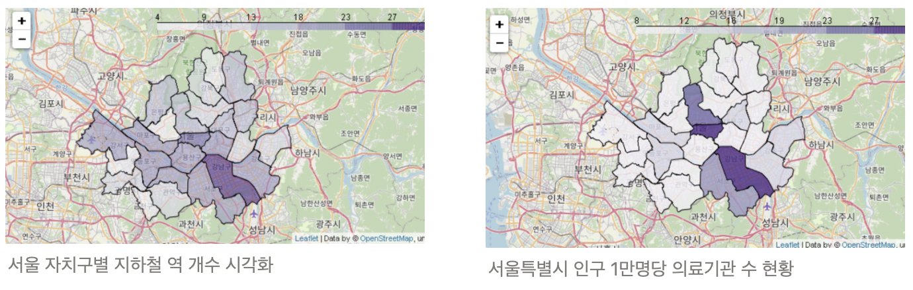

# Project : 의료기관 현황 및 개폐업 분석

 

<a href='https://seul1230-medical-institution-analysis-main-1ufm7a.streamlit.app/'>

</a>

 

### **I. 주제**
&nbsp; 의료기관 현황 및 개폐업 분석  

### **II. 주제 선정 배경**

코로나19 이후로 의료 인프라는 이루 말할 수 없이 중요한 사안이 되었다. 중환자 및 응급 병상 부족 문제가 심각해지고, 가속화되는 인구 고령화로 인해 지역 간 의료 인프라 불균형 문제가 점점 심각해지고 있다. 이에 따라 `성장발육엔텐텐`팀은 미니프로젝트에서 분석하였던 총 인구수(2008 - 2021)를 바탕으로 의료기관 데이터에 접근하고자 한다.

우선 지역 별 인구 수에 따른 현재 운영 중인 의료기관 수(2022.06 기준)를 분석한다. 목표는 지역 별 인구 수에 따른 의료기관 비율을 비교 분석하고 도표와 지도를 통해 시각화하는 것이다. 인구수에 따른 인프라 격차가 발생할 것이라는 가설을 검증하고 현재 의료 인프라가 부족한 지역을 찾는다. 더하여, 의료시설 개업과 폐업 데이터를 분석하여 상관계수 분석을 통한 인사이트를 얻고 앞으로의 인프라 격차를 개선시킬 수 있는 방안을 모색해 본다.  

### **III. 가설 설정**
1. 총인구수가 적은 행정구역은 현존하는 의료기관수가 부족할 것으로 예상한다
2. 고령화가 많이 진행된 지역에 현존하는 의료기관이 부족할 것이다
3. 의료기관수는 다른분야(문화, 환경, 교육)의 인프라와도 상관관계가 있을 것이다
4. (3-1) 서울시 강남구에 의료기관이 제일 많이 집중되어 있는 이유는 강남에는 미용목적 의료기관이 몰려있기 때문일 것이다.
5. 연도별 의료기관 개폐업수와 총인구수, 연령층 비율은 상관관계가 있을 것이다.  

### **IV. 결론 도출 및 배포**
**1. 행정구역의 총 인구 수와 의료기관 수는 양의 상관관계가 있다.**

- 행정구역의 총 인구 수와 의료기관 수는 양의 상관관계가 있다.

- 인구 1만명당 의료기관 수 데이터와 총합해서 보았을 때, 강원도와 울산이 의료인프라가 부족한 행정구역으로 분류되었다. 경기도와 인천 또한 의료 사각지대가 있을 것으로 판단된다.  

**2. 고령화가 많이 진행된 지역에 현존하는 의료기관이 부족할 것이다.**

- 고령화비율과 의료기관수는 뚜렷한 상관관계를 보이지 않는다.
- 의료기관의 현재 입지에는 다른 연령대 비율 또한 뚜렷한 상관관계를 보이지 않았다.

**3. 의료기관수는 다른분야(문화, 환경, 교육)의 인프라와도 상관관계가 있을 것이다.**

- 서울특별시 25개 구의 경우 의료인프라와 문화, 환경, 교육 인프라간에 뚜렷한 상관관계를 보이지 않는다.
- 의료인프라의 상관관계는 다른 인프라의 요인보다는 경제적 요인(지역구 소득수준, 지역구 평균 건물 임대료, 매출액 등등)이 큰 것으로 추정한다.

**4. 서울시 강남구에 의료기관이 제일 많이 집중되어 있는 이유는 강남에는 미용목적 의료기관이 몰려있기 때문일 것이다.**

- 강남구에는 의료 인프라가 몰려있는데, 구별 인구수와 비례하는 것은 아니다. 

- 강남구의 의료기관수 중 미용목적 의료기관의 비중이 높음을 확인 할 수 있었다.
  

**5. 연도별 의료기관 개폐업수와 총인구수, 연령층 비율은 상관관계가 있을 것이다.**

- 의료기관 개업과 폐업간의 상관관계는 매우 밀접하다.
- 지역을 서울, 경기로 한정하고 최근 연도의 데이터로 갈수록 의료기관 개폐업과 아동비율, 청소년비율간의 음의 상관관계가 있다.
- 폐업과 장년층 비율과 0.5정도의 양의상관관계가 나타난다.
- 아동, 청소년비율이 음의 상관관계를 갖는 결과에서 의료기관 개폐업은 비경제인구 비율과 반비례한다고 해석하였다.  개폐업에는 경제적 요인이 상관관계를 가질 수 있다는 근거로 생각하였다.  

### **V. 프로젝트 활용 방안**
각 행정구역별 지방정부 산하 의료기관 확충  

### **VI. References**
**보건의료빅데이터개방시스템 *Healthcare Bigdata Hub***

- 현재 전문 병의원 및 약국 현황
    
    [보건의료빅데이터개방시스템](https://opendata.hira.or.kr/op/opc/selectOpenData.do?sno=11925&pageIndex=1)
    
- 요양 병원 개설
    
    [보건의료빅데이터개방시스템](https://opendata.hira.or.kr/op/opc/selectOpenData.do?sno=11922&pageIndex=1)
    
- 요양 병원 폐업
    
    [보건의료빅데이터개방시스템](https://opendata.hira.or.kr/op/opc/selectOpenData.do?sno=11923&pageIndex=1)

- Folium
  
    [https://python-visualization.github.io/folium/](https://python-visualization.github.io/folium/)
- px.choropleth (동적 map visualization)
  
    [https://plotly.com/python/choropleth-maps/](https://plotly.com/python/choropleth-maps/)
    
- ****World Population EDA With World Map Visualization****
    
    <https://www.kaggle.com/code/prathameshgadekar/world-population-eda-with-world-map-visualization>

- **['의료취약지 발생 이유'는 "병원운영 어렵고 기본 인프라 부족탓"](http://www.medical-tribune.co.kr/news/articleView.html?idxno=93953)**
    
    

- **[지방은 이미 '무의촌화' 진행 중...의사 · 시설 모두 부족](https://news.sbs.co.kr/news/endPage.do?news_id=N1006862236)**
  

- **서울시 자치구 인프라 현황 자료**

    [당신이 '강남 3구'에 끌리는 이유](https://m.khan.co.kr/economy/economy-general/article/201810230600035#c2b)
